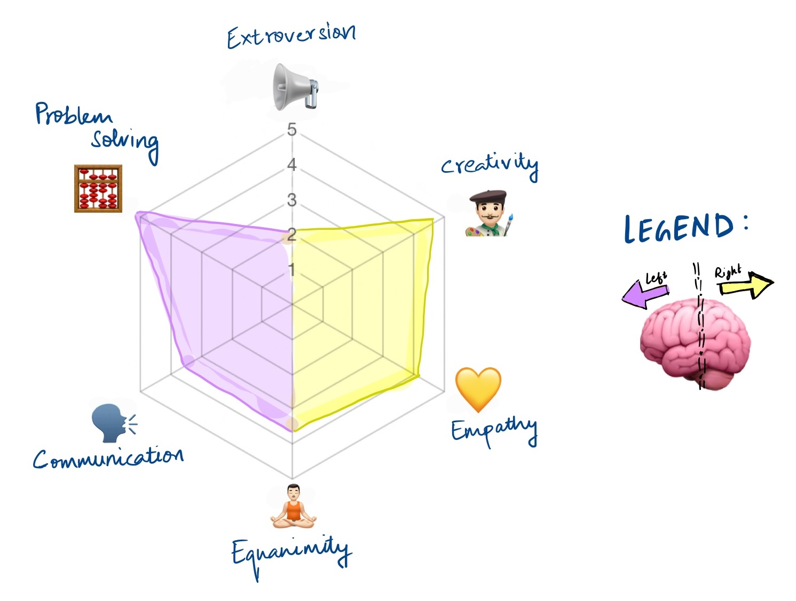

    

        
    

    

        
Hi there 👋🏽 I'm Siddharth (सिद्धार्थ), an experienced Software Engineer with 
            a versatile skillset in backend & data engineering. 
            I love challenges, and derive great satisfaction from understanding a business problem to its core
            and solving it at scale by leveraging the right technology, and under the given constraints.
        

    

    
    &nbsp;&nbsp;
    
    &nbsp;&nbsp; 
       
    &nbsp;&nbsp; 
        
    &nbsp;&nbsp; 
    
    &nbsp;&nbsp; 
     

    <h4>Education and Experience</h4>
    

    I'm currently pursuing a Masters degree in Software Engineering from the School of Computer Science, Carnegie Mellon University.
    Before CMU, I was working in India for about 4 years in Software & Data roles at Mu Sigma (2018-2019)
    and Directi (2020-2022).
    

    <h4>Interests</h4>
    
 Outside academia and work, I enjoy competitive programming 💻 learning spanish 🇪🇸 
    sketching 👨🏼‍🎨 chess ♟️ swimming 🌊 and gaming 🕹️ reading (fiction btw!) 📖. I've been told I'm equal-parts skilled on both sides of the brain. 
    Following the true gamer spirit, here's a radar chart to illustrate 

    
  

